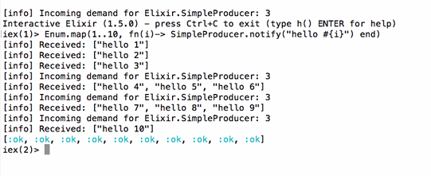

# [fit] A story about GenStage

## Pune Ruby

---


---


---


---

# App that searches sites live


---

# Old architecture: prototype in few days


---

# A year later: issues, issues


---

# Workers usually...


---

# GenStage

Two components:

* `producer` routes events to consumers
* `consumer` processes events

---

# The demand conversation

```
Consumer: "I can process 100 events"
Producer: "For now, take all the 60 events I have"

[later]
Producer: "Here are the other 40 events"
Consumer: "I can process 100 more"

[later]
Producer: "Here are 100 events"
```

---

# The demand conversation for real



---

# GenStage integration

* Add the gen_stage library
* Define producer
* Define consumer
* Define workers in process tree

---


---


---

# From 100secs to 5secs per user search


